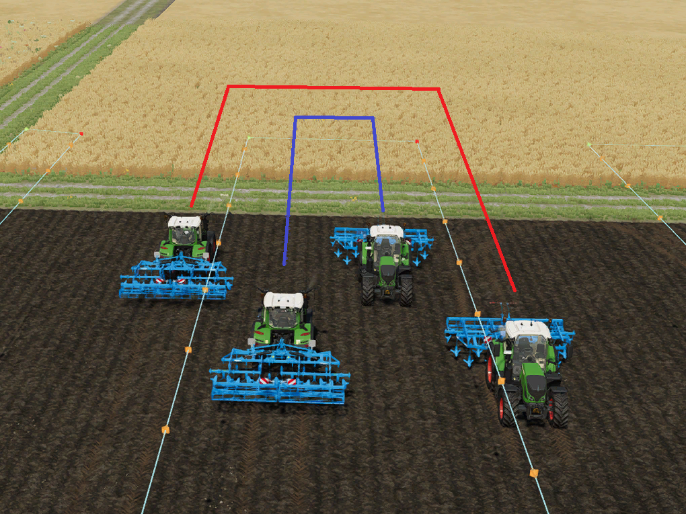
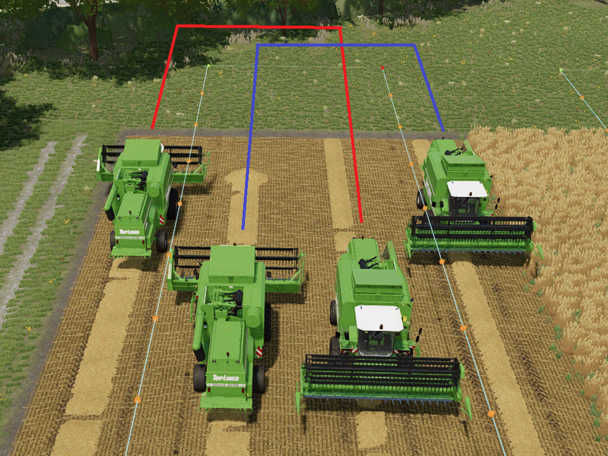

# Mudança de faixa simétrica

  
A troca de faixa é usada em cursos com múltiplas ferramentas e informa ao ajudante em qual faixa ele deve dirigir após a curva.  
Com a troca de faixa ativa, o veículo muda de lado após cada curva.  
Isso é um pouco difícil de entender, então vamos dar uma olhada em dois exemplos.  

  
Quando a mudança de faixa simétrica é desativada, o veículo permanece em sua faixa de deslocamento.  
Isso significa que ele sempre dirige para a esquerda ou para a direita da rota.  
Isso garante que os veículos não estejam dirigindo lado a lado.  
Não haverá risco de conflito com outro motorista.  

  
SSe a troca de faixas estiver ativa, por exemplo, para dois veículos, o veículo A à esquerda e o veículo B à direita, após a conversão, as faixas serão trocadas.  
Isso significa que o A fica à direita e o B à esquerda.  
A vantagem é que todos os veículos têm a mesma largura de curva e, portanto, a mesma distância a percorrer.  
Para colheitadeiras, essa configuração é importante, pois garante que o cano fique fora das frutas e não alcance outra faixa.  
A desvantagem é que os veículos têm a chance de colidir uns com os outros quando se aproximam em faixas próximas.  
  
Se você observar a ordem das faixas, da esquerda para a direita, ficará claro:  
Sem mudança simétrica: esquerda, direita, esquerda, direita - é quase como pular uma faixa.  
Com mudança simétrica: esquerda, direita, direita, esquerda - da esquerda para a direita, uma faixa após a outra.  
No exemplo com a colheitadeira, isso significa que nenhuma colheitadeira terá frutas à esquerda e à direita de sua faixa.  

