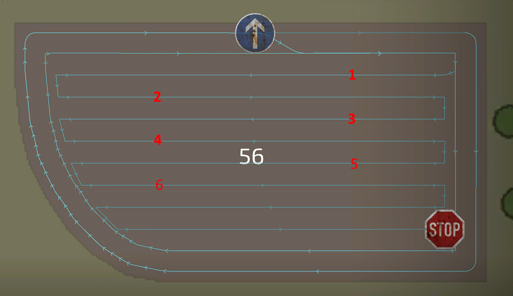
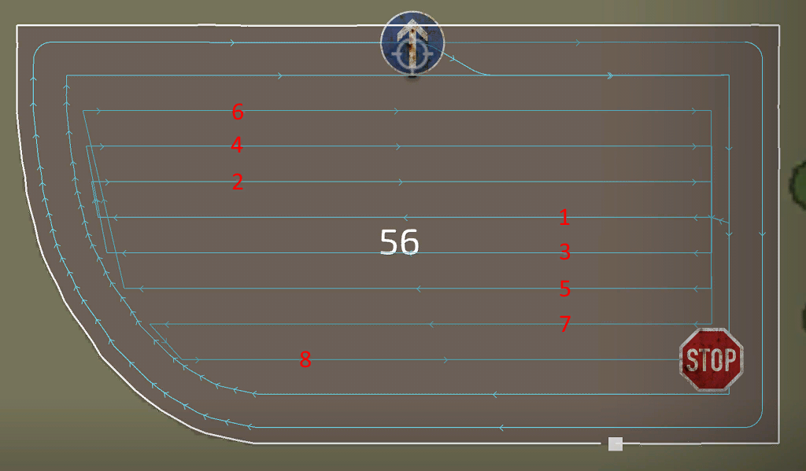
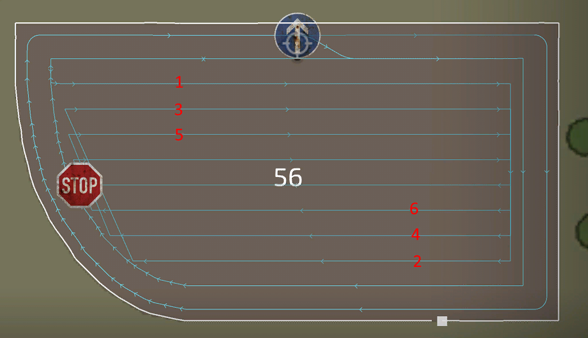
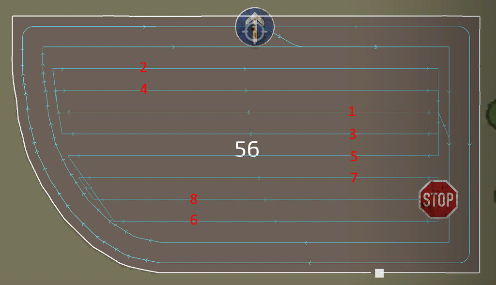

# Gerador de rotas: centro

  
Para o centro do campo, estão disponíveis diferentes estratégias para fazer o serviço. Na maioria das vezes, a alfaia selecionada é a razão para escolher uma estratégia específica em vez de outra. As estratégias disponíveis foram criadas com base no feedback e nas informações da nossa comunidade.  
A estratégia simples de ida e volta funciona quase sempre para qualquer alfaia. Mas pode ser melhor escolher outra; por exemplo, ao colher com uma ceifeira, os blocos são uma melhor forma de manter o tubo fora da cultura para uma descarga mais eficiente.  
Para picar, o modo circular pode ser uma melhor solução, com voltas menos apertadas, para facilitar o serviço do descarregador.  
A espiral é uma melhor solução para colhedoras rebocadas com um ajuste lateral, para manter a alfaia na cultura e o tractor fora dela.  

  
- Centro do campo: Há diferentes modos para o padrão do centro do campo. O clássico e mais usado é o de ida e volta.  
Espiral, circular e blocos têm as suas vantagens específicas sobre os outros. Os blocos, por exemplo, mantêm o tubo da ceifeira fora da cultura na maior parte do tempo, para descarregar mais facilmente.  
- Direcção no centro: Funciona da mesma forma que na cabeceira, mas agora pode ser definida de forma independente.  
- Faixas uniformes: Se o centro dum campo tiver uma largura total que não pode ser dividida uniformemente pela largura de trabalho da alfaia, a primeira ou a última faixa fica com um resto estreito. Para evitar isto, a largura de cada faixa é reduzida para obter uma divisão uniforme entre todas as faixas.  
- Direcção das faixas: o automático encontra geralmente a melhor direcção, mas às vezes o lado mais comprido encaixa melhor. Se não ficares satisfeito com nenhum dos dois, escolhe manual e define a direcção manualmente.  
- Ângulo das faixas: Quando a direcção das faixas está definida como manual, esta configuração aparece e diz ao gerador a direcção das faixas.  
  
Estas configurações só aparecem para escolhas específicas feitas antes:  
- Saltar faixas: Aparece quando o centro do campo está definido como "ida e volta". É uma opção muito útil para acelerar o serviço, pois as alfaias não precisam de fazer marcha atrás para virar para a faixa seguinte.  
- Faixas por bloco: Aparece quando o centro do campo está definido como "blocos". Só tem impacto nesse modo e diz ao gerador quantas faixas cada bloco deve ter. Quantas mais faixas, menos blocos são gerados.  
- Espiral de dentro para fora: Aparece quando o centro do campo está definido como "espiral".  
- Número de círculos: Aparece quando o centro do campo está definido como "circular".  

## 
ida e volta

## 
blocos

## 
espiral

## 
circular

