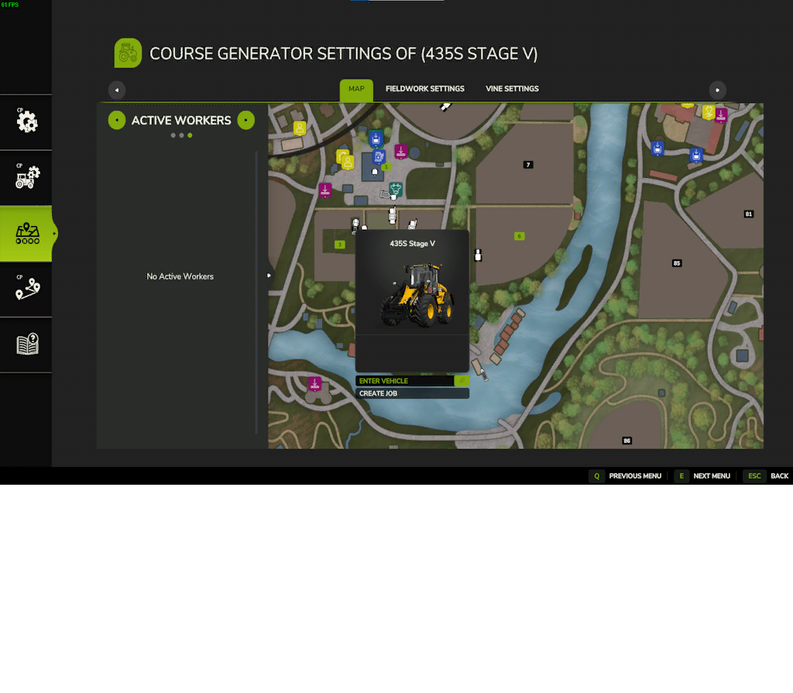
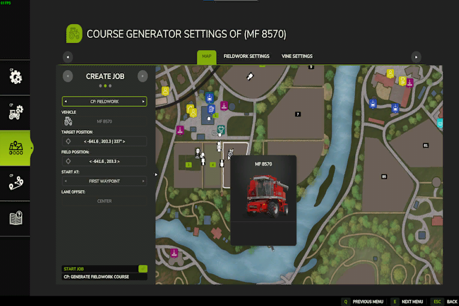

# Utökad AI-meny

Hjälparinställningar finns nu under vår egen nya meny "Hjälparinställningar". Den fungerar ungefär som den gamla AI-menyn. Välj ett fordon i AI-menyn för att skapa ett jobb, baserat på de bifogade verktygen eller det valda fordonet. Förutom kartan och jobbinställningarna hittar du inställningarna för bangeneratorn och vinbanegeneratorn högst upp. Dessa är endast åtkomliga med ett giltigt verktyg när du skapar ett jobb. För att generera en bana och starta Courseplay-jobben måste du skapa jobbet CP: Fieldwork med ett giltigt verktyg eller fordon. Tips: För att få snabbare åtkomst kan du klicka på "no course" på HUD. Då kommer du till menyn med ett jobb som redan har skapats för fordonet.

För att komma igång med ditt första CP-jobb måste du välja ett fordon och ett eventuellt giltigt redskap som stöds för jobbet. Genom att klicka på "Skapa jobb" kan du sedan välja ett CP-jobb för det valda verktyget eller fordonet.

Om du har valt ett CP-jobb måste du placera fältpositionen på ett fält för att generera banan eller använda balsökaren på den. Positionen styr också i stort sett startpunkten för din bana. Om du vill använda Giants-hjälpen för att köra till fältet måste du också ställa in målpositionen nära banans startpunkt. Inställningen för banförskjutning används endast om du vill ha flera hjälpare som arbetar på samma fält. För detta, se den separata sidan i hjälpmenyn nedan. Tips: Om du redan står på banan när du klickar på "ingen bana" för att komma till menyn, är markörerna redan utplacerade.

När fältpositionen är korrekt placerad på ett fält kommer du att se fältgränsen ritad på kartan. Om du skapar ett CP: Fieldwork-jobb får du tillgång till inställningarna för kursgeneratorn.

Nu är det möjligt att starta föraren direkt från menyn. Giants helper kommer att köra till målpositionen och därifrån tar CP-jobbet automatiskt över. Alternativt kan du också starta föraren från HUD om du befinner dig nära fältet med fordonet eller använder AutoDrive-modulen för att leverera CP-jobbet nära fältet.

