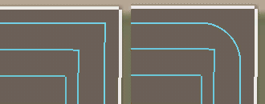

# Kursgenerator: vändtegen

Inställningar för vändtegar visas bara när du har ställt in minst en vändteg. Du får alternativ för var du ska börja, hörninställningar, riktning och överlappning. Vändtegar rekommenderas starkt för att förhindra att verktygen lämnar fältet när du svänger.

- Skärpa hörnen på uddarna: Skärpa hörnen på de vändtegar som inte är rundade. Kommer att tvinga fordonet att svänga på vändtegen när vändtegens krökning är mindre än fordonets svängradie. - Antal runda hörn: Antal vändtegar, räknat från den yttersta, som kommer att ha rundade hörn. Rundade hörn baseras på fordonets svängradie, så för dessa vändtegar kommer fordonet inte att utföra någon svängmanöver i hörnen. - Radie för hörn: Ställer in radien för de runda hörnen. Om du vet att ett efterföljande arbetsverktyg har en minsta radie på 10, kan du ställa in detta värde till 10 för banan. - Vändtegsriktning: medurs eller moturs. Detta kan vara viktigt för skördetröskor och skördare, beroende på vilken sida röret eller transportbandet är på. - Överlappning på vändtegen: Hur mycket ett vändteg överlappar med nästa. Detta för att undvika att missa frukt i vissa fall.

