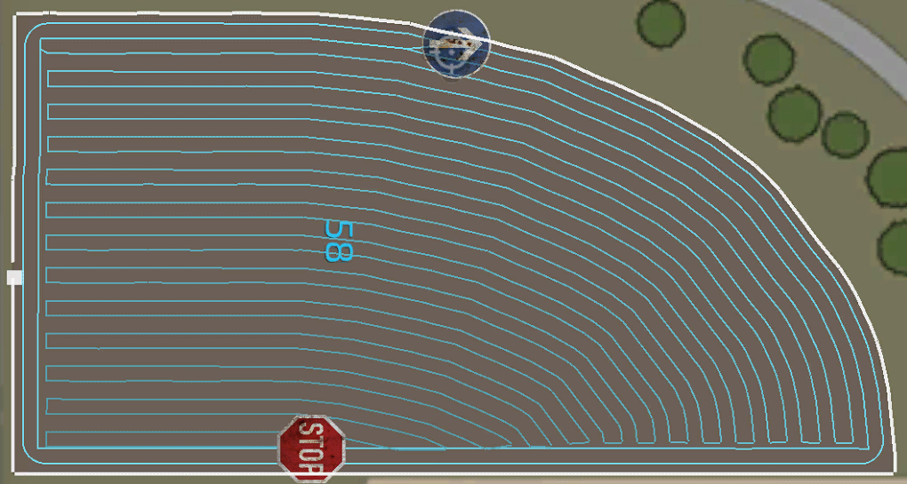

# Kursgenerator: expertinställningar

Vissa inställningar är bara synliga om du ställer in expertläget till aktivt i de globala Courseplay-inställningarna. Innan du leker med dessa inställningar bör du se till att du vet vad grundinställningarna gör. Vissa expertinställningar fungerar bara korrekt under vissa förhållanden.  - Flera verktyg: Den här inställningen används när du vill att mer än ett fordon ska arbeta på din bana. Eftersom detta blir lite mer komplicerat finns det ett separat hjälpämne för det. - Växla körfält: När det här alternativet är aktivt byter fordonen fil vid varje sväng, så att varje fordons sväng blir lika bred. Se den extra hjälpmenyn "Byta körfält" för mer information. - Fältmarginal: Med denna inställning kan du flytta fältets kant inåt eller utåt från den ursprungliga kanten. - Smalt fält: Skapar vändtegen endast vid fältets två korta kanter. I detta fall är det inte möjligt att hålla fordonet på fältet på de längsta kanterna vid vändtegen. - Överlappning på vändtegen: Som standard överlappar vändtegspassagerna varandra (men aldrig fältkanten) med några procent för att undvika att missa frukt i vissa kantfall. Du kan ändra denna överlappning här. - Använd baslinjekant: Med den här inställningen kan du generera böjda rader uppåt/nedåt som löper parallellt med fältkanten nära fältmarkören. Detta är logiskt när fältkanten inte är rak, eftersom raderna uppåt/nedåt följer kantkurvan. VIKTIGT: Det här är en experimentell inställning som kanske inte fungerar för alla fältformer. Om det inte fungerar, prova en annan inställning.

