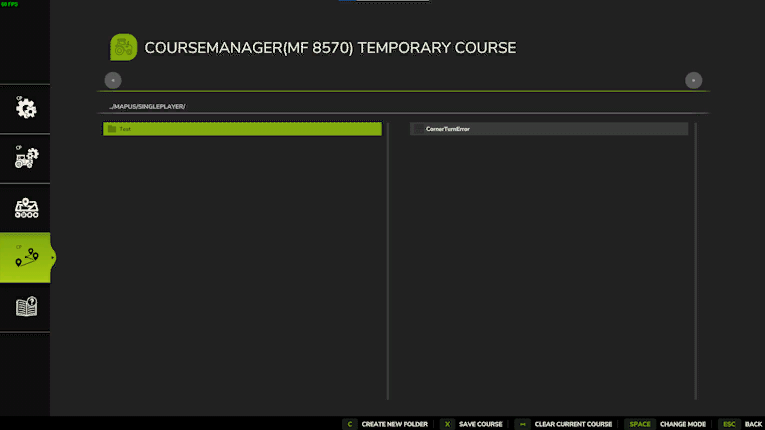
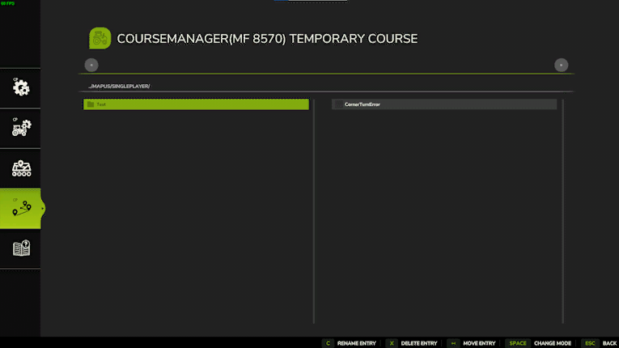

# Kursansvarig

Med kurshanteraren kan du spara kurser och ladda den sparade kursen senare igen. Detta är mycket viktigt när du vill att flera arbetare ska köra samma bana i konvoj (multiverktyg). Med den här funktionen kan du också plocka upp den sträng som en skördetröska eller en windrower har lämnat efter sig med en fodervagn eller en balpress.  Sparplatsen för banfilerna är: ..\My Games\FarmingSimulator2025\modSettings\FS25_Courseplay\Courses\Mapname.SampleModMap (eller för vanilj t.ex. MapUS). Kurshanteraren fungerar på ett annat sätt än vad du är van vid i FS19. Kurserna sparas i mappar, som visas till vänster. Det innebär att du behöver minst en mapp att börja spara kurser i.  Mappar kan enkelt skapas genom att trycka på knappen längst ner på skärmen och ange ett namn. Kurser sparas bara lokalt för tillfället.

När du har laddat en kurs kan du spara den genom att välja en mapp och sedan klicka på knappen Spara kurs. Då visas ett popup-fönster där du kan ange namnet på din kurs. Namn och plats kan ändras i efterhand. Om du vill ta bort kursen från ditt fordon klickar du på knappen "Clear current course". För att ladda en kurs måste du först välja mappen, sedan välja kursen och sedan helt enkelt klicka på knappen Load Course. Om du klickar på ändringsläget aktiveras redigeringsläget i kurshanteraren.

När redigeringsläget är aktivt har du följande alternativ: - Flytta en kurs till en annan katalog. - Ta bort kurser eller kataloger. - Byta namn på kurser eller kataloger.

För att flytta en kurs: 1) Klicka på knappen Flytta längst ner på skärmen.   2) Klicka på den kurs du vill flytta.   3) Klicka på den katalog som kursen ska flyttas till. För att byta namn behöver du bara klicka på knappen Rename och därefter på katalogen eller kursen. Sedan är det bara att skriva in det nya namnet. För att ta bort en kurs eller katalog klickar du på delete-knappen och därefter på den mapp eller kurs du vill ta bort. Kataloger måste vara tomma för att du ska kunna radera dem.

