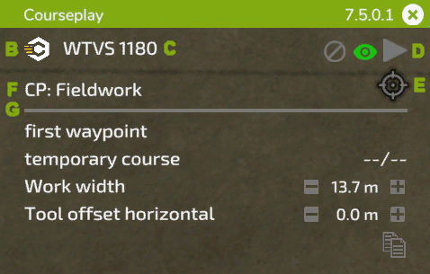
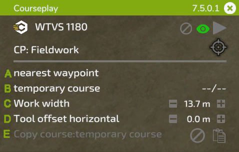
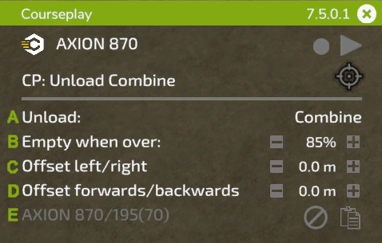
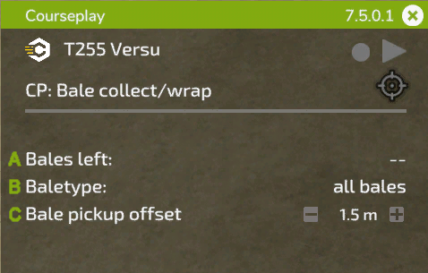
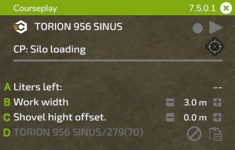
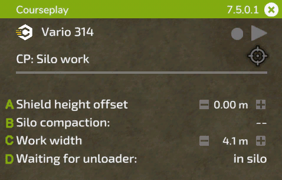

# Mini HUD

## Allmänna funktioner

A: Håll vänster musknapp på rubriken för att dra HUD till en position som du vill ha. På höger sida visas den installerade versionen och X:et stänger HUD:en med ett musklick. B: Klicka på ikonen Courseplay för att komma åt de globala inställningarna. C: På denna position visas namnet på ditt fordon. Om du klickar på det kommer du till menyn för fordonsinställningar. D: Dessa symboler är till för att: (1) radera den aktuella banan, (2a) växla hur banan ska visas, (2b) om ingen bana är laddad visas en inspelningsknapp för att spela in en fältgränsbana, (3) starta eller stoppa hjälpen. E: Den här målikonen har olika alternativ beroende på valt läge, den öppnar AI-menyn med jobbet och gör det möjligt att placera markören och göra ytterligare inställningar för jobbet. På vänster sida av ikonen, när ett fältarbete pågår, visas den återstående tiden för kursen. F: Klicka på texten för att växla mellan de tillgängliga lägena för dina aktuella verktyg. G: De inställningar som visas under denna rad beror på det aktuella jobbet. Dessa förklaras med hjälp av följande bilder.

## Fältarbete

S: Klicka för att välja var arbetet ska påbörjas. Om en multiverktygsbana är laddad kan du välja bana på höger sida. B: Visar namnet på den laddade banan. Om du just har genererat en bana visas "tillfällig bana". På höger sida visas de aktuella/totala waypointsen när jobbet har startat. C: Om du klickar på texten beräknas arbetsbredden på nytt, eller så kan du ställa in den manuellt till höger genom att klicka på +/- eller med mushjulet över siffran. D: Vissa verktyg behöver en förskjutning åt sidan. Courseplay beräknar den automatiskt när du klickar på texten, eller så kan du ändra den manuellt precis som arbetsbredden. E: Använd symbolen på höger sida för att kopiera den aktuella kursen till urklipp. Namnet på den kopierade kursen visas sedan till vänster. Du kan lägga in den kopierade kursen i ett annat fordon som ännu inte har någon kurs. För att ta bort kursen från urklipp, klicka på symbolen för borttagning.

## Skördetröska avlastare

A: Välj vilken typ av fordon som medarbetaren ska lossa. Detta är användbart om du har olika typer, t.ex. en skördetröska och en lastare som ROPA Maus, som arbetar på samma fält. B: Ställ in fyllnadsgraden (40 % - 100 %) som arbetaren ska köra till lossningsplatsen. Klicka på +/- eller använd skrollhjulet över siffran för att ändra. C: Ibland är avlastarens position under röret inte perfekt. Detta kan bero på släpet eller skördarens rör, ibland orsakat av fältets lutning. Du kan korrigera avståndet till skördaren manuellt här. D: Samma sak som ovan, men här kan du justera lossarens position i förhållande till röret framtill eller baktill. E: På samma sätt som vid kopiering av en bana kan du här kopiera markörpositionerna till ett annat fordon.

## Balar samlas in/omlindas

A: Kvarvarande balar på fältet. B: Typ av balar som ska samlas in/plastas. C: Förskjutning mellan traktorns mittlinje och lastararmens mittlinje. Du kan behöva justera detta för större traktorer (t.ex. med bredare däck).

## Silolastare

A: Kvarvarande storlek på högen i liter. B: Arbetsbredd, samma som vid fältarbete. C: Courseplay kräver att skopans exakta höjd över marken är korrekt inställd. Eftersom denna höjd kan vara olika för varje verktyg kan du kontrollera och justera den med denna inställning. D: Precis som med avlastaren kan du kopiera markörpositionerna till ett annat fordon.

## Siloarbetare

A: På samma sätt som för silolastaren är höjden på nivåvippan avgörande. Du kan justera den här. B: Visar hur komprimeringen fortskrider. Om du klickar på den växlar du mellan alternativet att stoppa föraren när komprimeringen är klar. Om du klickar på den kan du välja att stoppa föraren när komprimeringen är klar. C: Här kan du ändra arbetsbredden vid behov. D: Denna inställning anger att arbetaren ska vänta i silon eller på en vald parkeringsplats när en avlastare närmar sig silon.

