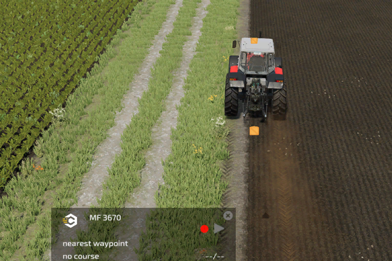
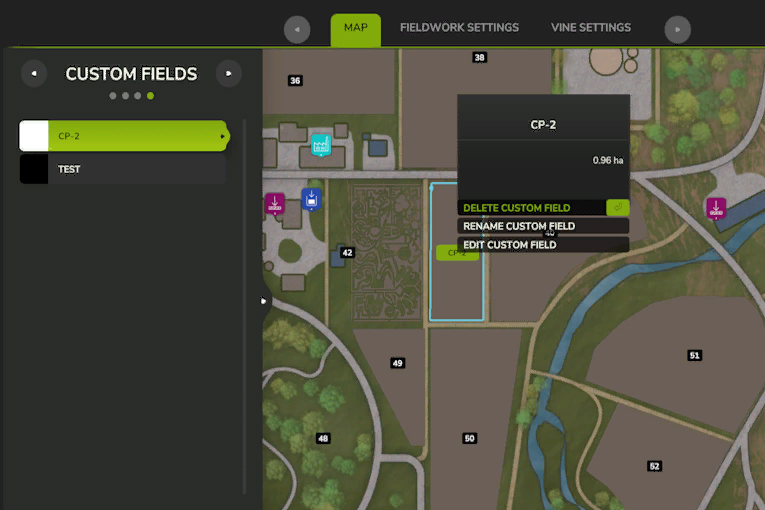

# Anpassade fält

Det finns två sätt att skapa anpassade fält. Det första är att använda HUD:s registreringsfunktion. Tryck först på knappen för banregistrering och kör sedan fältgränsen som du vill registrera. När du är klar trycker du bara på knappen igen så får du frågan om du vill spara den. Start och slut får inte överlappa varandra!

De anpassade fältgränserna kommer att visas i AI-menyn. Genom att klicka på namnet får du möjlighet att antingen ta bort, byta namn på eller redigera det med redigeraren.

Det andra alternativet är att rita det anpassade fältet på kartan i CP AI-menyn. För att starta ritningen klickar du på knappen i det nedre vänstra hörnet eller trycker på motsvarande tangent. Därefter visas en text överst på skärmen. Börja med att klicka på höger musknapp för att ställa in startpositionen. Genom att hålla in shift-tangenten kommer linjen att läggas rakt i 90°-vinklar. Nästa klick skapar linjer till det föregående klicket. När du har ritat en andra linje stängs banan automatiskt. Du kan fortfarande dra fler linjer för att definiera fältet ännu mer. Du behöver inte dra den sista linjen till starten, eftersom den genereras automatiskt rakt till starten.

