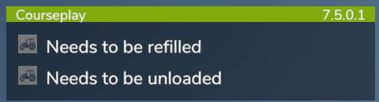

# Information om panelen

Det här är vår infopanel, den kan flyttas runt med muspekaren, precis som vår mini HUD. Förutom namnet och versionen av vår mod, visar den också statusinformation om Courseplay-förarna. När du håller muspekaren över statusmeddelandet visas fordonets namn. Genom att klicka på det kan du hoppa direkt in i fordonet.

Statusmeddelandena är: - Hjälparen sitter fast - Blockerad av ett föremål - Bör tankas - Behöver tankas - Behöver repareras - Behöver fyllas på - Behöver lossas - Avslutat arbete - Kör till skördetröskan - Kör till släpet - Slut på pengar - Väntar på att regnet ska sluta - Väntar på att snön ska försvinna - Väntar på lossaren - Lämnade banan, stoppad - Fel baltyp - Ingen väg hittad - Tippning till marken inte möjlig - Skäraren stöds inte - Skärarens fastsättning avaktiverad - Fel säsong för frukt - Fel frukt för valt uppdrag - Pallarna är fulla - Inga pallar

