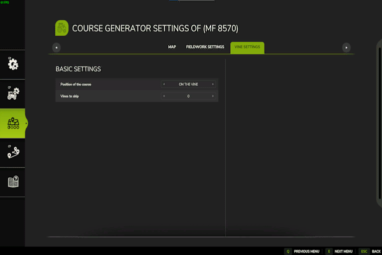
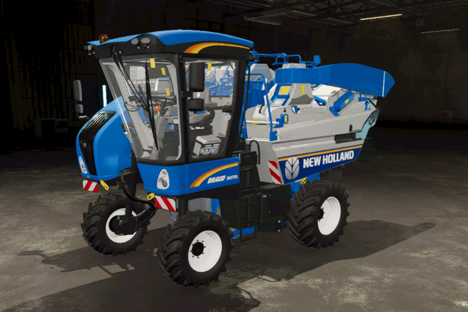
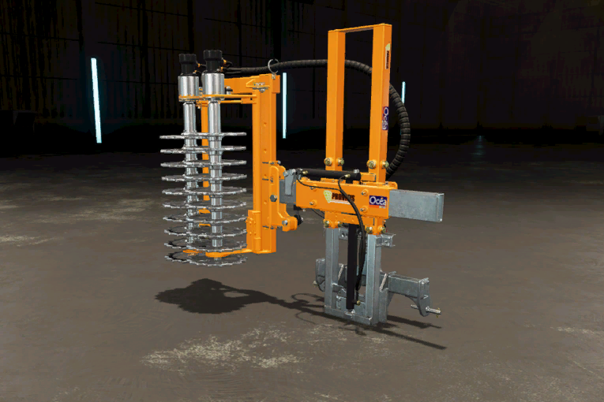
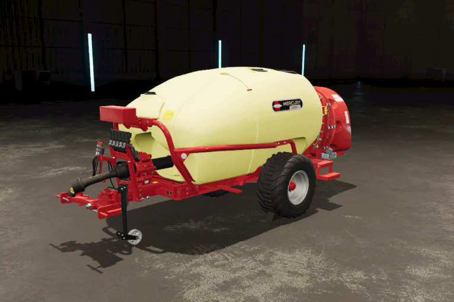

# Arbete med vinstockar

Att arbeta med vinrankor är lite mer komplicerat än att arbeta på ett vanligt fält. För att få bästa resultat bör alla rankor ligga bredvid varandra inom standardrutnätet. Slutet och början på varje vinranka bör också vara ungefär lika långa. Om vinrankorna står på ett befintligt fält kan du öppna generatorn direkt som vanligt. Om de inte ligger på ett fält måste du gå över till AI-menyn och placera fältmarkören på rankorna.

Generatorn för vinrankor har färre alternativ. Beroende på verktyget måste du välja om du vill arbeta på eller bredvid vinrankorna. T.ex. måste standardskördaren köra och arbeta på vinrankan.      Förbeskäraren måste köra till vänster om vinrankorna men arbetar på vinrankan, så du måste välja att arbeta på vinrankan, men köra med en förskjutning.      Sprutor måste köra bredvid vinrankorna och måste hoppa över en rad, eftersom den sprutar till vänster och höger.

En vinstockskurs bör genereras på vinstockarna, eftersom den måste köra och arbeta på vinstockarna.

Förbeskäraren arbetar på vinrankorna, så kursen måste skapas på vinrankorna. Verktyget levereras med en offset för traktorn, så traktorn kör mellan vinrankorna.

Sprutan arbetar bredvid vinrankorna, så den måste köra antingen till vänster eller höger om vinrankorna. Eftersom sprutan kan arbeta på vänster och höger vinranka samtidigt kan vi hoppa över en rad.

