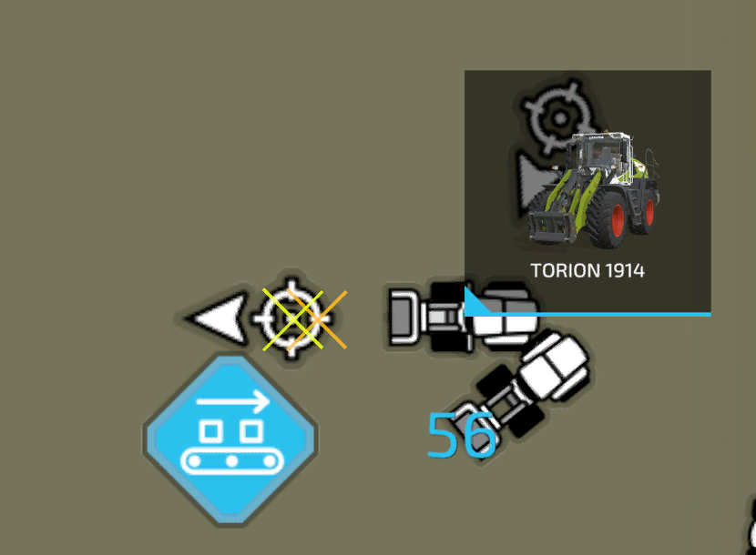

# Hjullastare/Frontlastare

Detta läge möjliggör användning av hjullastare och traktorer med frontlastare.  Med en påmonterad spade kan en hög plockas upp från marken eller lastas från en bunkersilo. Den upplockade fyllnadsnivån kan automatiskt lossas till en närliggande släpvagn eller en utvald lossningsstation, t.ex. en BGA. Spaden flyttas automatiskt till rätt position för lastning, lossning och så vidare. Om läget inte är direkt synligt på HUD:en kan du växla "startposition" tills spadläget visas.  Målikonen på HUD:en kan användas för att öppna AI-kartan och välja mål för lastning och lossning. HUD:en visar också den kvarvarande fyllnadsnivån i högen eller silon medan hjälparen arbetar. Om lastningsmålet är en bunkersilo kan arbetsbredden behöva justeras för att undvika att träffa silons sidoväggar.  Inställningen för höjdförskjutning används för att justera höjden över marken, eftersom inte alla skopor kan beräknas korrekt.  Detta bör kontrolleras om skopan är för låg för lastning och föraren inte kan svänga längre eller om skopan är för hög och fyllnadsnivån inte når ner till marken. Om värdet ändras kommer skopan automatiskt att flyttas till lastningspositionen för att visa effekten av förskjutningen. För att återställa förskjutningen måste du klicka på inställningstexten i HUD. Värdet kan justeras från +1 till -1 i 0,1 setps.  Skopor med ensilagegrip öppnas och stängs automatiskt för lastning och lossning. Skopan för att strimla sockerbetor är också helt funktionell.

För att starta en hjullastarhelikopter måste du ställa in lastnings- och lossningspositionerna genom att klicka på målikonen på HUD. Laddningspositionen fungerar på samma sätt som den från lastarläget. En blå kvadrat kommer att skapas runt högen.  Avlastningspositionen beror på om du vill lossa i en trailer eller i en avlastningsstation. Om du väljer att lossa i släpet måste området där släpet ska parkeras väljas på AI-menyn. Hjälparen kommer att köra till alla parkerade släpvagnar i området. Markörens riktning har ingen egentlig betydelse. Om du vill lasta av på en lossningsstation måste du byta mål och sedan markera avtryckaren med lossningspositionen.

Att välja en utlösare ser först lite komplicerat ut, men i själva verket är det väldigt enkelt. Varje byggnad kan ha mer än en utlösare, så du måste välja den du vill lossa till. Alla tillgängliga utlösare visas med ett orange kors på AI-kartan. För att välja en placerar du mitten av den runda markören på mitten av korset. Pilens riktning talar om för hjälparen från vilken riktning han ska närma sig utlösaren för lossning. Nu bör ditt val se ut som på bilden.

